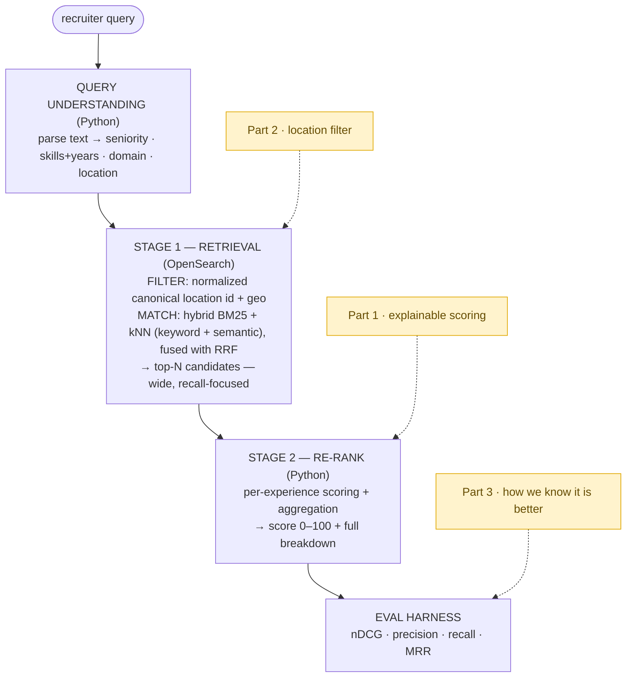

# Zeil Search — Technical Assessment

This repo is my answer to the Zeil search assessment. The brief said the reasoning is what
matters, and that no specific stack is required. So the **written answers are the main
deliverable** — they are in [`answers/`](answers/). But I also built a small **working
prototype in OpenSearch**, because I wanted to prove that my reasoning
is real and not hand-waving. Every number in the written answers comes from this code
actually running.

## The three answers (start here)

- [`answers/part1-relevance.md`](answers/part1-relevance.md) — Relevant Experience Score
- [`answers/part2-location.md`](answers/part2-location.md) — Location Filter at Scale
- [`answers/part3-testing.md`](answers/part3-testing.md) — Testing, Diagnosis & Collaboration

## The core idea: two-stage hybrid search



Cheap and wide first (retrieval), expensive and precise after (re-rank). Same shape as real
production search. The semantic (kNN) half is what makes the "financial services" example
work, because that phrase is never in the candidate's text — the engine has to understand
that trading at Goldman and payments at Stripe *are* financial services.

## Quickstart

Requires [`uv`](https://docs.astral.sh/uv/) and Docker. (uv manages Python 3.14 and the
virtualenv — no manual venv or pip needed.)

```bash
make setup    # start OpenSearch, sync deps, index the data (one command)
make demo     # see the Part 1 + Part 2 demos
make eval     # see the quality metrics (Part 3)
make test     # run the test suite
```

`make help` lists every command. Under the hood each target is just `uv run ...`, so you can
also run things directly:

```bash
uv run zeil search "Senior backend engineer, 5+ years Python, financial services"
make search Q="truck driver near Parramatta" PROX=30
```

If you prefer the steps separately: `make up` (start + wait for OpenSearch), `make install`
(`uv sync --extra dev`), `make ingest`.

## What to look at

| If you want to see... | Look at |
|---|---|
| The scoring logic + explainable breakdown (Part 1) | `src/zeil/rank/score.py` |
| Location normalize + gazetteer resolution (Part 2) | `src/zeil/location/normalize.py` |
| Suburb proximity + how scoring flips by intent (Part 2) | `src/zeil/rank/geo.py` |
| Hybrid retrieval (BM25 + kNN + RRF) | `src/zeil/query/retrieve.py` |
| The eval harness + metrics (Part 3) | `src/zeil/eval/` |
| The index design (nested, knn_vector, geo_point) | `src/zeil/index/mappings.py` |

## Notes / scope

This is a reasoning prototype, not production. It runs on a small synthetic dataset
(`data/candidates.json`) so the logic is easy to see. Scale topics (800M profiles,
multi-script, ingest pipelines) are discussed in the written answers, not built.

## Tests

The logic-heavy parts are test-driven: location normalization, the scoring engine, the eval
metrics, and geo proximity. The tests double as runnable documentation of expected behaviour.
